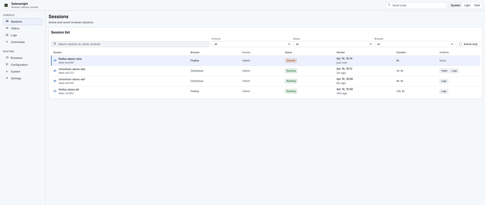

# Selenwright UI

Operator console for [Selenwright](https://github.com/aqa-alex/selenwright) — a browser automation grid with native Selenium and Playwright support.

Dense, readable interface for monitoring live sessions, browsing artifacts (videos, logs, downloads), and managing browser inventory. Built with Vue 3 + TypeScript, served by a lightweight Node.js proxy.


<sup>Light and dark themes available via the header toggle.</sup>

## Run locally

```bash
npm run dev
```

The app serves on `http://127.0.0.1:4173` by default. Override with `HOST` / `PORT` env vars.

By default it will try a lightweight proxy connection to `http://127.0.0.1:4444` for `/status`, `/logs/?json`, and `/video/?json`. Override the target if needed:

```bash
SELENWRIGHT_TARGET=http://selenwright.internal:4444 npm run dev
```

The local server also proxies `/api/vnc/<session-id>` as a WebSocket endpoint so the Vue noVNC viewer entry in `vnc.html` can watch live sessions with `vnc: true`.

If the target is unavailable, the UI falls back to an embedded demo dataset so layout and navigation remain fully usable.

## Deployment

This UI has no built-in authentication and proxies `DELETE` and live WebSocket traffic straight to the upstream Selenwright service. Bind it to loopback (`HOST=127.0.0.1`, the default) and front it with an authenticating reverse proxy before exposing to the network. Do not run with `HOST=0.0.0.0` on an untrusted interface.

**WebSocket Origin check.** The proxy rejects `Upgrade` requests whose `Origin` header does not match the `Host` the request came in on. When running behind a reverse proxy that presents a different hostname to the browser, set `SELENWRIGHT_ALLOWED_ORIGINS` to the comma-separated list of public origins — for example:

```bash
SELENWRIGHT_ALLOWED_ORIGINS=https://selenwright.example.com npm start
```

Non-browser clients that do not send an `Origin` header (CLI, WS libraries) are always allowed through.

**Session termination.** `DELETE /api/sessions/{id}?protocol=selenium` terminates Selenium/WebDriver sessions via the standard `/wd/hub/session/{id}` route. Playwright sessions are driven over WebSocket and cannot be terminated via HTTP; the proxy returns `501` for `protocol=playwright` and the client must close its WebSocket to stop the session.

## Docker

Build image:

```bash
docker build -t selenwright-ui:latest .
```

Run container:

```bash
docker run --rm -p 4173:4173 \
  -e SELENWRIGHT_TARGET=http://host.docker.internal:4444 \
  selenwright-ui:latest
```

The container listens on `0.0.0.0:4173`.

## Docker Compose

Run prebuilt image:

```bash
docker compose -f docker-compose.yml up
```

Build and run locally:

```bash
bash build.sh
```

## Checks

```bash
npm run build
npm run check
```

## Structure

- `index.html` bootstraps the app and applies theme + density preferences before paint.
- `server.mjs` serves the static app and proxies lightweight API requests.
- `src/app/` contains the main console shell and Vue pages.
- `src/vnc/` contains the separate Vue noVNC viewer entry.
- `src/data/` contains typed data adapters and normalization.
